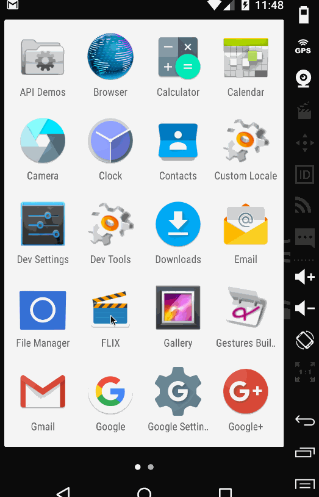
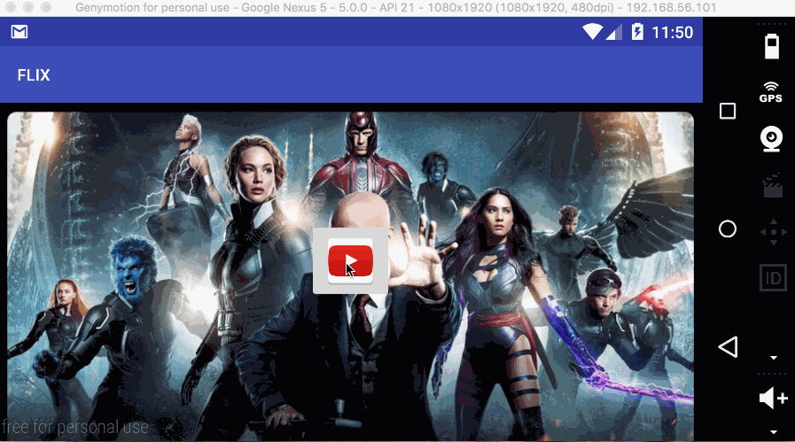

# Flicks

Flicks is a read-only movie listing app using the Movie Database API.

Submitted by: Shankar Sundaram

Time spent: 10 hours spent in total

## User Stories

The following **required** functionality is completed:

* [x] User can view a list of movies (title, poster image, and overview) currently playing in theaters from the Movie Database API.
* [x] Views should be responsive for both landscape/portrait mode and fully optimized for performance with the ViewHolder pattern. In portrait mode, the poster image, title, and movie overview is shown. In landscape mode, the rotated layout should use the backdrop image instead and show the title and movie overview to the right of it.

The following **optional** features are implemented:

* Display a nice default placeholder graphic for each image during loading
* Improve the user interface through styling and coloring 
  * Changed the icon launcher
  * Changed background colors
  * Changed text sizes and fonts
  * (Tried to display launcher icon on the action bar but it doesn't seem to work)
* For popular movies (i.e. a movie voted for more than 5 stars), the full backdrop image is displayed. Otherwise, a poster image, the movie title, and overview is listed. Uses Heterogenous ListViews and uses different ViewHolder layout files for popular movies and less popular ones. 
* Expose details of movie (ratings using RatingBar, popularity, and synopsis) in a separate activity. 
* Allow video posts to be played in full-screen using the YouTubePlayerView 
  * When clicking on a popular movie (i.e. a movie voted for more than 5 stars) the video should be played immediately.
  * Less popular videos rely on the detailed page should show an image preview that can initiate playing a YouTube video.
* Add a you tube play icon overlay to popular movies to indicate that the movie can be played.
* Apply the popular ButterKnife annotation library to reduce view boilerplate. 
* Add a rounded corners for the images using the Picasso transformations

## Video Walkthrough 

Here's a walkthrough of implemented user stories:

GIF created with [LiceCap](http://www.cockos.com/licecap/).

## Notes

Youtube player starts, shows the title correctly but does not play the video in the genymotion emulator. Downloaded the app on an android phone and it works fine.

## License

    Copyright [2016] [Shankar Sundaram]

    Licensed under the Apache License, Version 2.0 (the "License");
    you may not use this file except in compliance with the License.
    You may obtain a copy of the License at

        http://www.apache.org/licenses/LICENSE-2.0

    Unless required by applicable law or agreed to in writing, software
    distributed under the License is distributed on an "AS IS" BASIS,
    WITHOUT WARRANTIES OR CONDITIONS OF ANY KIND, either express or implied.
    See the License for the specific language governing permissions and
    limitations under the License.

